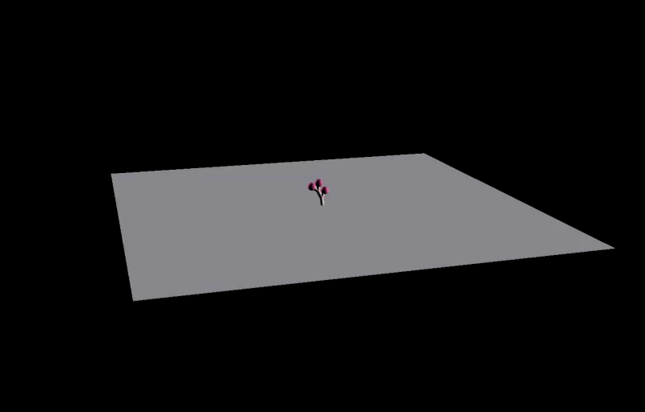
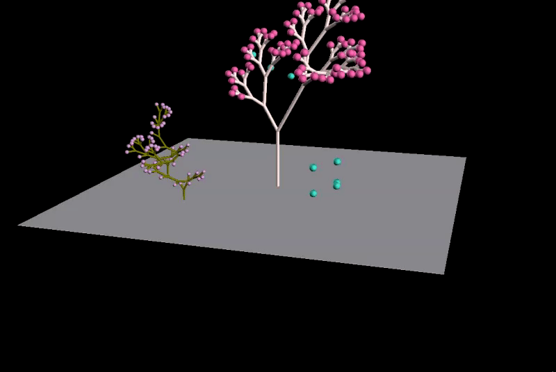
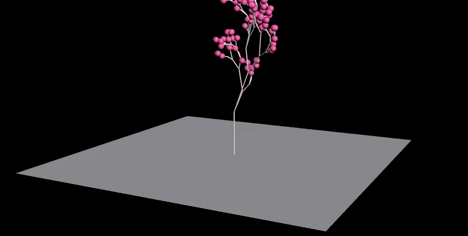

# L-system-boids
A demo of procedural plant generation using the L-system (https://en.wikipedia.org/wiki/L-system), as well 
as an implementation of the Boids flocking AI created by Craig Reynolds 

# Build instructions:

- Open the model.vcxproj VC++ project in Visual Studio

- IMPORTANT: Make sure that you are building the 'Release' build, or the fltk libraries won't be able to compile:

   --Build->Configuration Manager...->select 'Release' from the drop down for 'Active Solution Configuration'
   --Close the configuration manager and proceed to build
  
# Demonstration:
  
The L-system's recursive generation in action, using a predefined grammar:
   

The Boids simulation in action--flocking around a target:

Some different shapes that can be generated using stochastic grammar:

   